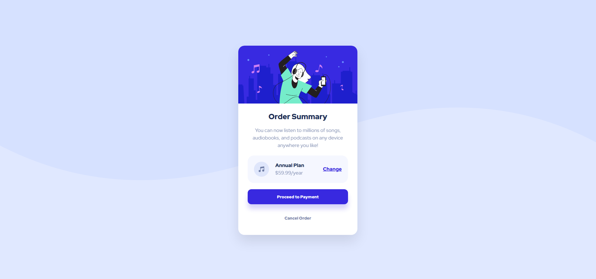

# Frontend Mentor - Carte de résumé de commande (Order Summary Card)

Ceci est ma solution au challenge [Order summary card sur Frontend Mentor](https://www.frontendmentor.io/challenges/order-summary-component-QlPmajDUj).

## Sommaire

- [Aperçu](#aperçu)
  - [Le challenge](#le-challenge)
  - [Capture d'écran](#capture-décran)
- [Mon processus](#mon-processus)
  - [Technologies utilisées](#technologies-utilisées)
  - [Ce que j'ai appris](#ce-que-jai-appris)
  - [AI Collaboration](#ai-collaboration)
- [Auteur](#auteur)

## Aperçu

### Le challenge

L'objectif était de reproduire fidèlement le design fourni pour différents formats (Mobile, Tablette, Desktop). Les utilisateurs doivent pouvoir :

- Voir les états au survol (hover) sur les boutons et les liens.
- Naviguer sur une interface totalement responsive.

### Capture d'écran



## Mon processus

### Technologies utilisées

- **HTML5** : Utilisation de balises sémantiques (`<main>`, `<strong>`, etc.).
- **CSS3** : Utilisation de variables (`:root`), de Flexbox pour le centrage absolu et d'une approche \*\*\*\*.
- **Mobile-First Workflow** : Respect du design system (couleurs et typographies) fourni par Frontend Mentor et approche mobile first.

### Ce que j'ai appris

Ce projet m'a permis de solidifier mes bases en Responsive Design. J'ai notamment appris à utiliser les variables CSS pour maintenir un code propre et à gérer les ombres portées (`box-shadow`) pour donner un aspect moderne aux boutons.

```css
/* Exemple d'ombre portée pour un effet moderne */
.btn-primary {
  box-shadow: 0 15px 15px rgba(56, 41, 224, 0.2);
}
```

### AI Collaboration

Pour ce projet, j'ai utilisé Gemini comme assistant pour finaliser le projet :

- Commentaires du code : Aide à la rédaction de commentaires clairs et pertinents dans les fichiers HTML et CSS pour une meilleure lisibilité.
- Suppression de doublons : Nettoyage de la structure du projet en identifiant et en supprimant les fichiers inutiles ou redondants.
- Rédaction du README : Accompagnement dans la création d'une documentation professionnelle et structurée pour présenter le projet sur GitHub.

## Auteur

- Github - [NovaDigit Studio](https://github.com/novadigitstudio-code)
- Frontend Mentor - [@novadigitstudio-code](https://www.frontendmentor.io/profile/novadigitstudio-code)
